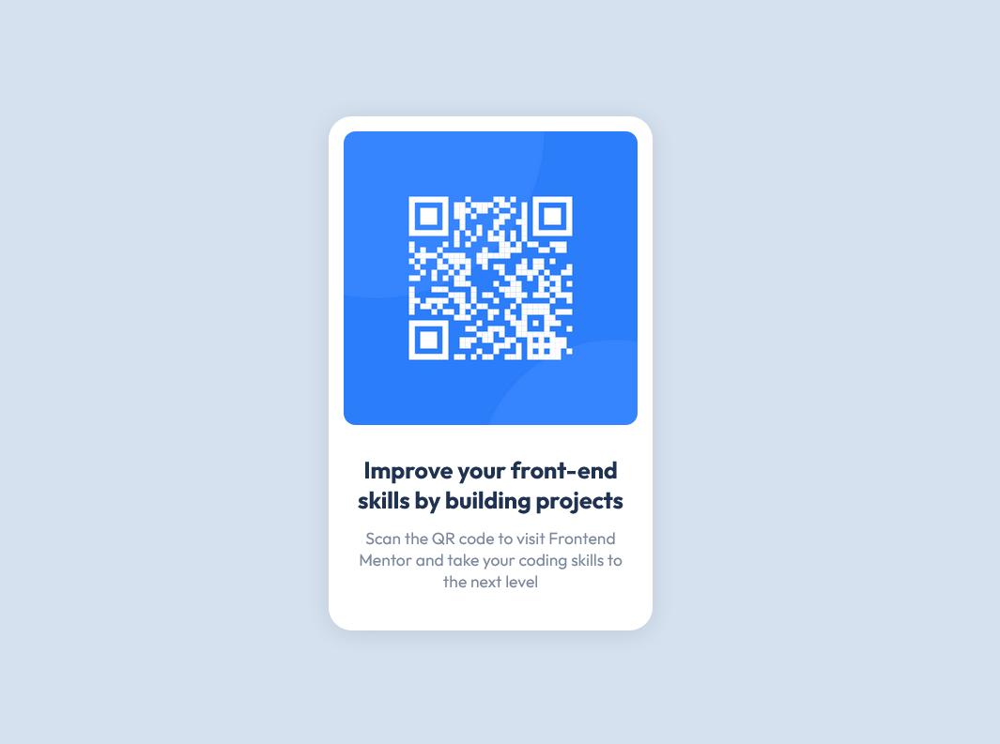

# Frontend Mentor - QR code component solution

This is a solution to the [QR code component challenge on Frontend Mentor](https://www.frontendmentor.io/challenges/qr-code-component-iux_sIO_H). Frontend Mentor challenges help you improve your coding skills by building realistic projects. 

## Table of contents

- [Overview](#overview)
  - [Screenshot](#screenshot)
  - [Links](#links)
- [My process](#my-process)
  - [Built with](#built-with)
  - [What I learned](#what-i-learned)
  - [Continued development](#continued-development)
  - [Useful resources](#useful-resources)
- [Author](#author)

## Overview
The solution is made up of mainly and index.html file and a style.css file, with some images.
As seen in the screenshot below, there is a qr code image which when scanned takes you to the frontend mentor official website.

### Screenshot




### Links

- Solution URL: ["QR Code Component Preview"](https://agbortoko.github.io/qr-code-component/)
- Live URL: ["QR Code Component Live Implementation"](https://easythingz.net/project/qr-code-component)

## My process

### Built with

- Semantic HTML5 markup
- CSS custom properties
- Flexbox
- CSS Variables
- Mobile-first workflow

### What I learned
- I learned how to make my design mobile first and also to avoid using media queries if not needed. Most site elements are already responsive, so i learned to only modify what is needed.
- Making use of properties such as min-height and max-width and great assets for responsiveness.

```css
    body{
        min-height: 100vh;
    }

    .card{
        max-width: 350px;
    }
```

- I learned to make use of css variables and also global classes which help to simplify styling
in my css i created a global class for background which i applied on the body tag.

```css
    /* Global classes */
    .bg-light{
        background-color: var(--light);
    }
```

- I learned how to make an image responsive, by making use of the max-width property

```css
.card-header img{
    max-width: 100%;
    width: 250px;
}

```


### Continued development

In my future projects i want to continue on learning how to make good use of css variables, and 
also how to work more on a mobile first outlook for my website designs

### Useful resources

- [W3schools Box Shadows reference](https://www.w3schools.com/css/css3_shadows_box.asp) - This helped me look into how to work with box-shadows.
- [The Outfit Font](https://fonts.google.com/specimen/Outfit?vfquery=Outfit) - This is font i used for this solution. I got it from google fonts


## Author

- Website - [Easythingz](https://easythingz.net)
- Frontend Mentor - [@Agbortoko](https://www.frontendmentor.io/profile/Agbortoko)
- Twitter - [@agbortoko_arrey](https://twitter.com/agbortoko_arrey)

